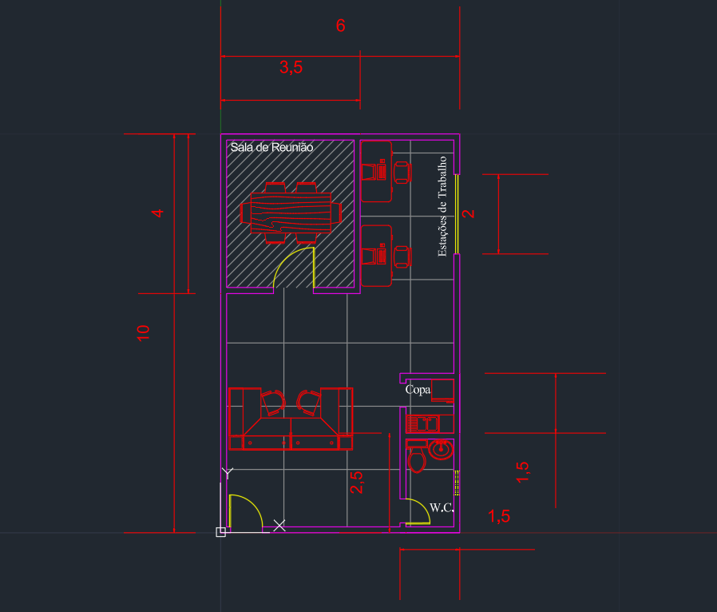
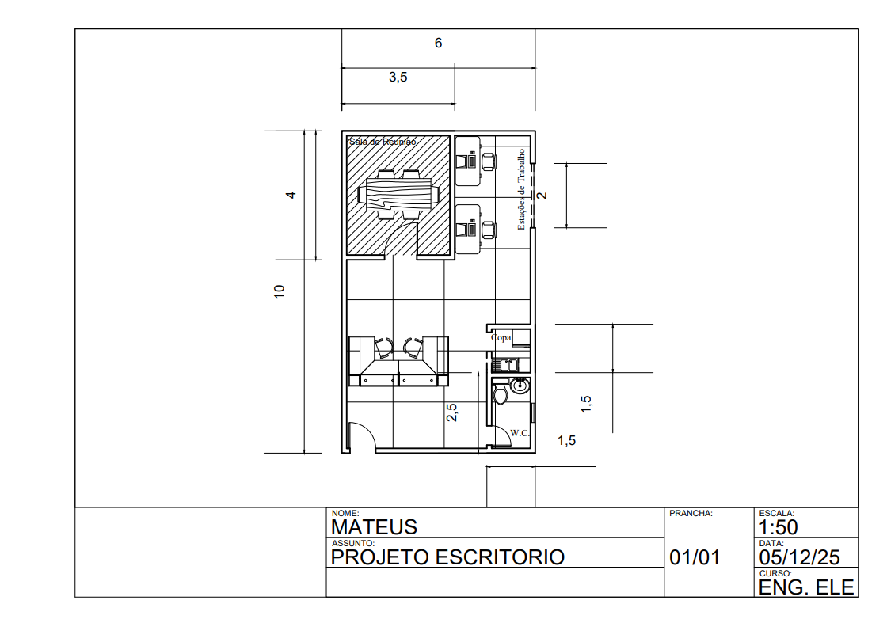

# office-project-fullcycle
Projeto de planta baixa de uma sala comercial de 60m² feito no AutoCAD 2026.

-----

Este repositório contém o projeto arquitetônico de um escritório de 60m², desenvolvido em **AutoCAD**. O objetivo do projeto é demonstrar proficiência em desenho técnico, aplicação de normas (ABNT) e uso de ferramentas relevantes.

## 📸 Visualização

| Model Space (Desenho) | Plotagem (Entrega Final) |
|:---:|:---:|
|  |  |

## 📂 Estrutura do Projeto

Esse projeto consiste da planta baixa (no **AutoCAD**), modelagem em BIM 3D (via **Revit**), projeto elétrico e diagramas unifilares de uma sala comercial de 60m². O objetivo é demonstrar proficiência em softwares relevantes, normas técnicas, layout e plotagem. Como a finalidade é um projeto simples que demonstre familiaridade com as ferramentas usadas, o layout da sala é simples e pouco pensado. Consistindo em uma sala de reunião, copa, área de trabalho, recepção e W.C. devidamente dimensionados e mobiliados.

## 🚀 Roadmap e Próximos Passos

Este projeto é um estudo contínuo. As próximas etapas de desenvolvimento incluem:

- [x] Planta Baixa Arquitetônica em AutoCAD (Concluído).
- [ ] Modelagem BIM 3D em Revit (Em breve).
- [ ] Projeto de Instalações Elétricas e Luminotécnico (Em breve).
- [ ] Compatibilização e Diagramas Unifilares.

## Como acessar

1.  **PDF:** Acesse a pasta [`/docs`](./docs) para visualizar a prancha final com carimbo e cotas.
2.  **DWG:** O arquivo fonte está na pasta [`/src`](./src).

---
*Desenvolvido por Mateus*
